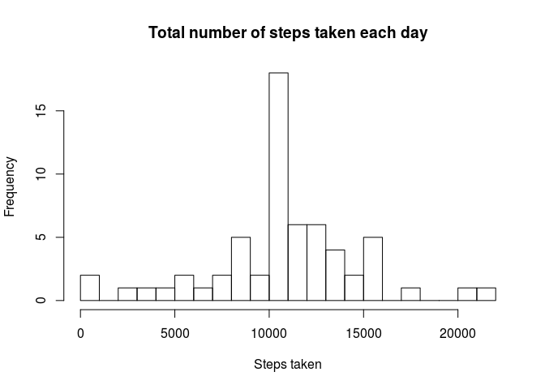

```r
knitr::opts_chunk$set(fig.path="figure/")
```

This is my submission for the "Reproducible Research" Course Project 1 from
Johns Hopkins University on Coursera.

## Loading and preprocessing the data

Here we load any packages we will be using in this project.
Next we unzip the activity.csv file if it does not exist in the working 
directory, and load the file to a data frame.


```r
library(dplyr)
library(lattice)
if(!exists("activity.csv"))
        unzip("activity.zip")

activity <- read.csv("activity.csv")
```

## What is mean total number of steps taken per day?

Here we calculate the total steps taken per day, plot a histogram of the total
number of steps taken each day, and finally we calculate and report the mean and
median values of the total steps taken.


```r
totalSteps <- activity %>% group_by(date) %>% summarize(total = sum(steps, na.rm = TRUE))
with(totalSteps, hist(total, breaks = 20, 
     main = "Total number of steps taken each day", 
     xlab = "Steps taken"))
```

<!-- -->

```r
mean(totalSteps$total, na.rm = TRUE)
```

```
## [1] 9354.23
```

```r
median(totalSteps$total, na.rm = TRUE)
```

```
## [1] 10395
```

## What is the average daily activity pattern?

In this step we aggregate the steps taken across each 5-minute interval,
averaged across all the days. We then plot a time series plot of the average
steps taken as a function of the intervals. The intervals range from 0
(denoting midnight), to 2355, denoting 23:55, with a jump to the next 100 
(whole hour) after each instance of the value 55. The interval ID's repeat
for each day, thus an average of an interval is automatically an average of
that interval averaged across all the days.


```r
intervalAverages <- activity %>% group_by(interval) %>% 
        summarize(averageSteps = mean(steps, na.rm = TRUE))
                                         
with(intervalAverages, plot(interval, averageSteps, type = "l", 
     main = "Average steps taken per time interval",
     xlab = "Interval", ylab = "Average steps taken"))
```

<!-- -->

We also want to find which 5-minute interval, on average across 
all the days in the dataset that contains the maximum number of steps.


```r
intervalAverages[which.max(intervalAverages$averageSteps),1][[1]]
```

```
## [1] 835
```

## Imputing missing values

Here we want to calculate the number of missing NA values, and impute the 
missing values. We will do this by replacing missing values with the mean value
for the 5-minute interval the missing data belongs to.

First we calculate and report the number of missing values.


```r
sum(!complete.cases(activity))
```

```
## [1] 2304
```

Next we merge the activity data frame with the average steps for each interval,
which will repeat for all of the days in the data frame. We then run a check
on each value of steps in the data frame, and replace this value with the mean
if this is a NA value. Finally we create a dataset equal to the original by 
selecting only the columns that were in the original data set.
 

```r
imputed <- cbind(activity, averageSteps = intervalAverages$averageSteps)
imputed$steps <- ifelse(is.na(imputed$steps), imputed$averageSteps, imputed$steps)
activity <- imputed %>% select(steps:interval)
```

Finally we plot a histogram of the total steps per day using the
imputed dataset, and compute and report the new mean and median total steps per day.


```r
totalSteps <- activity %>% group_by(date) %>% summarize(total = sum(steps, na.rm = TRUE))
with(totalSteps, hist(total, breaks = 20, 
     main = "Total number of steps taken each day", 
     xlab = "Steps taken"))
```

<!-- -->

```r
mean(totalSteps$total, na.rm = TRUE)
```

```
## [1] 10766.19
```

```r
median(totalSteps$total, na.rm = TRUE)
```

```
## [1] 10766.19
```

  
We see that the mean and median are higher when imputing missing values. This
is due to the fact that when using na.rm in the original data set, the steps for
the intervals with NA are set to 0. Thus when replacing these zero-valued rows 
with the higher valued means, the total number of steps will have a higher value
and this a higher mean and median.

## Are there differences in activity patterns between weekdays and weekends?

First we create a new factor variable in the dataset with the levels "weekday"
and "weekend"


```r
activity$dayType <- ifelse(weekdays(as.Date(activity$date)) 
                           %in% c("Saturday", "Sunday"), "weekend", "weekday")
activity$dayType <- as.factor(activity$dayType)
```

Finaly we make a panel plot of the time series of the average steps per interval
across all weekday or weekend days.


```r
intervalAverages <- activity %>% group_by(dayType, interval) %>% 
        summarize(averageSteps = mean(steps, na.rm = TRUE))
xyplot(averageSteps ~ interval | dayType, data = intervalAverages, type = "l",
       layout = c(1, 2), ylab = "Number of steps")
```

<!-- -->
